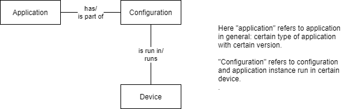

# Koe 15.20 7.5.2020

Testaan miten markdown file viedään githubiin siten että sen sisältö saadaan siellä näkyviin (kuten rootin README.md -tiedostoissa)

##  ER -model and database mode
- Entities

